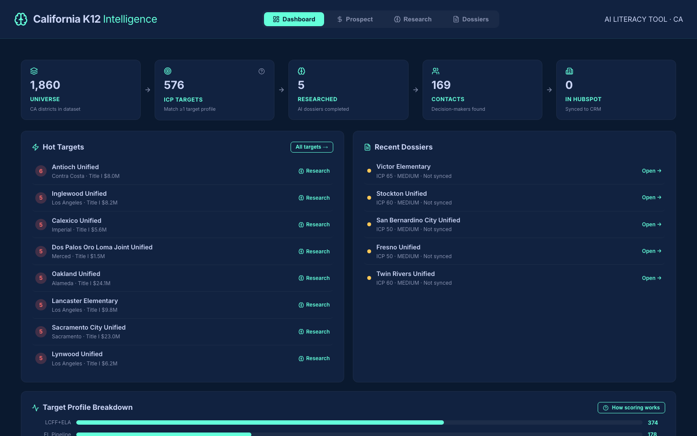
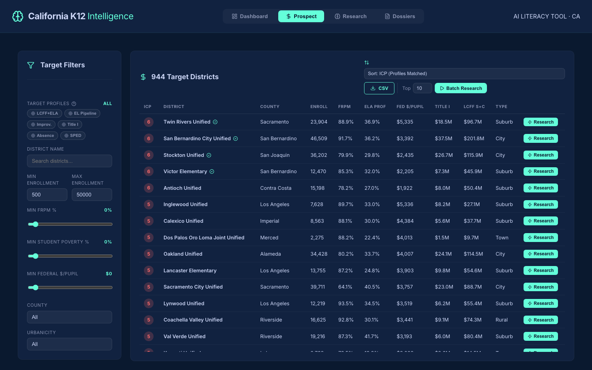
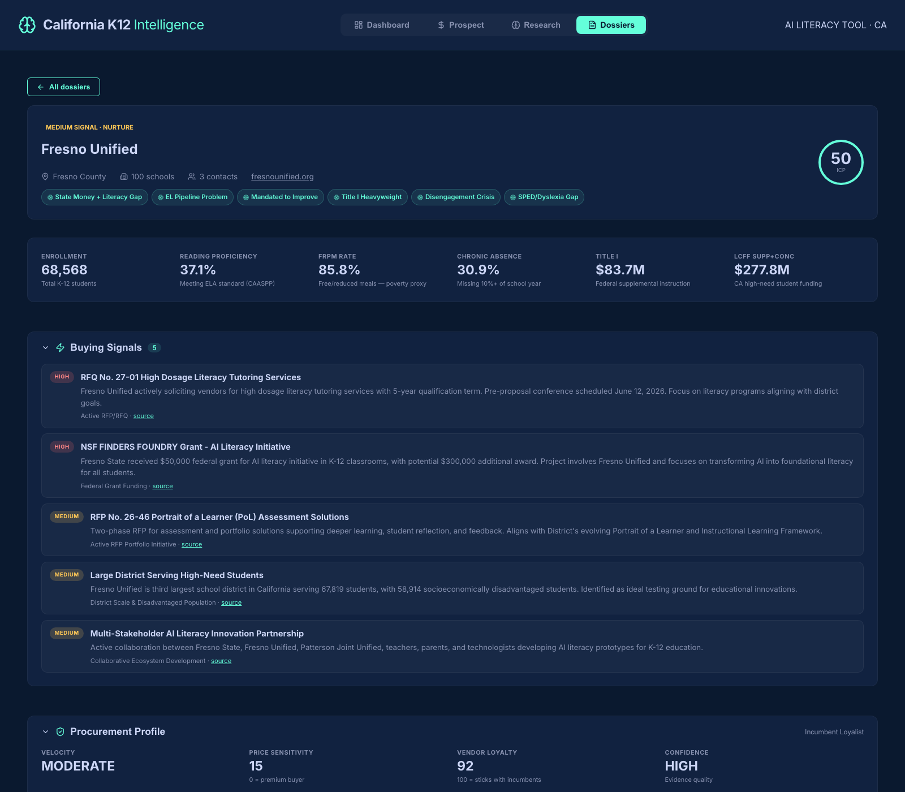

# California K12 Intelligence

[](LICENSE)


**An open-source GTM (go-to-market) platform for selling into California school districts.** It scores all 1,860 CA districts against your ideal customer profile, runs an AI research agent on the best targets, finds the decision-makers, and syncs everything into HubSpot.

## The story behind this project

A client hired me to build the outreach engine for their AI literacy tool — one product, sold exclusively into California school districts. Everything in this repo was purpose-built for that engagement: the target profiles encode *that product's* funding logic, and the datasets are California's. Their problem is the problem every EdTech company has: there are 1,860 school districts in California, and maybe 50 of them are worth a sales rep's time *this quarter*. Which 50? And once you know, what do you say to them?

Answering that by hand takes an analyst weeks. This platform does it in an afternoon:

1. **Score** every district using public funding and performance data — no API calls, no cost.
2. **Research** the top targets with an AI agent that reads district websites, board meeting minutes, and local news.
3. **Sync** the results into HubSpot as companies and contacts, ready for outreach.

I've open-sourced it as-built. It is deliberately **not** a configurable multi-product platform — it's the real, working system from one engagement. If you sell something else into K-12, reusing it means changing exactly two files (see [Reusing this for your own product](#reusing-this-for-your-own-product)); the pipeline, the datasets, and the CRM integration carry over unchanged.

## What it looks like



A single web app with four views:

| View | What it does |
|---|---|
| **Dashboard** | The landing page. A pipeline funnel (Universe → Targets → Researched → Contacts → In HubSpot), your hottest unresearched targets, recent research reports, and a breakdown of which target profiles your market matches. |
| **Prospect** | All 1,860 districts in a sortable table with an ICP score badge on every row. Filter by target profile, enrollment, poverty, funding, county. Click any row to open a CRM-style record panel with 12 funding metrics and one-click actions. |
| **Research** | Pick a district and hit go. A live activity feed shows the AI agent working; a full intelligence dossier appears when it finishes. |
| **Dossiers** | The library of every research report: ICP score, buying signals, decision-makers, and a written brief — with HubSpot sync status on each. |





## How the scoring works (no AI, no cost)

The repo ships with a 68-column dataset covering every California district, built from public sources:

- **National**: NCES F-33 finance survey, Census SAIPE poverty estimates, ACS income data, CCD directory (via the [edfinr](https://github.com/bellwetherorg/edfinr) R package by Bellwether and the Urban Institute's [Education Data Portal](https://educationdata.urban.org/)).
- **California-specific**: LCFF supplemental/concentration funding, free/reduced meal counts, CAASPP reading proficiency, ELPAC English-learner scores, chronic absenteeism, and school improvement status (from the California Department of Education).
- **Firmographics**: mailing address, phone, geo-coordinates, and school counts for every district (NCES/CCD directory, rebuildable with `scripts/build_district_directory.py`).

Contact emails are discovered from published district addresses rather than a paid data vendor — see `data_sources/email_finder.py`.

Six **target profiles** turn that data into sales intelligence. Each profile is a plain data rule that maps to a specific pitch and a specific funding source the district could use to buy your product. For example:

> **"State Money + Literacy Gap"** — the district receives over $1M in LCFF supplemental/concentration funding *and* fewer than half its students read at grade level. They have the money and the need. The pitch writes itself.

The other five: EL Pipeline Problem, Mandated to Improve, Title I Heavyweight, Disengagement Crisis, and SPED/Dyslexia Gap. A district matching 4+ profiles is a hot account. Out of the box, 576 of 1,860 districts match at least one profile. The rules live in one function in [`data_sources/local_funding.py`](data_sources/local_funding.py) — rewrite them for your product in minutes.

## How the AI research works

When you research a district, an agent pipeline runs eight phases:

1. **Crawl** the district's website (30–50 pages: technology plans, HR directories, board pages).
2. **Extract** 80+ data points from that corpus with Claude.
3. **Detect the tech stack** — their LMS, SIS, 1:1 device program, Google vs. Microsoft.
4. **Augment in parallel**: NCES firmographics, leadership tenure, board meeting analysis, 18 months of local news.
5. **Board intelligence**: a pre-built map of 904 CA districts' board portals (BoardDocs, Simbli, self-hosted) takes the agent straight to meeting agendas, where it looks for your product's trigger topics.
6. **E-Rate**: recent federal technology funding applications.
7. **Signal detection**: an agentic loop where Claude decides what follow-up searches to run.
8. **Score and write**: an ICP score, buying signals, and a readable intelligence brief.

Results persist to a local database, appear in the Dossiers library, and are ready to sync to HubSpot. A **batch mode** runs the pipeline over your top N targets unattended (start it from the Prospect view or the CLI) and skips districts you've already researched, so re-running always continues where you left off.

## From research to written outreach

Every dossier has a **Draft Outreach Sequence** button. It generates one email per matched target profile — ordered by funding-angle strength, personalized with evidence from the research (board actions, program adoptions, leadership changes), and governed by the writing rules in [`prompts/core_rules.md`](prompts/core_rules.md). Those rules are the distillation of what actually works in K-12 cold outreach, and they're worth reading even if you never run the code. The four that matter most:

1. **Reference their actions, not their problems** — "I saw your board approved a structured literacy initiative," never "your reading scores are critically low."
2. **Ask, don't tell** — end with a soft question, not a pitch.
3. **Funding as context, not pressure** — "districts with similar profiles typically fund this through LCFF," never "you have $19.5M that could pay for this."
4. **Position as peer, not expert** — you're starting a relationship with someone who knows their district better than you ever will.

Drafts appear on the dossier (copy-to-clipboard per email, with suggested recipients drawn from the contact intelligence) and travel to HubSpot as a note on the district's company record when you sync.

**Cost**: each district costs roughly $0.50–1.25 in Anthropic (Claude Haiku) and Tavily credits and takes 3–7 minutes. The scoring layer is free — you only pay for districts you choose to research.

## Quickstart

You'll need Python 3.11+, Node 18+, and two API keys to start ([Anthropic](https://console.anthropic.com/) and [Tavily](https://tavily.com/) — both have low-cost entry tiers).

```bash
git clone https://github.com/shanewin/k12-research-agent.git
cd k12-research-agent

# Backend
python3 -m venv venv
source venv/bin/activate
pip install -r requirements.txt
cp .env.example .env        # then paste your API keys into .env

# Frontend
cd frontend && npm install && cd ..
```

Run it (two terminals):

```bash
uvicorn main:app --port 8000
```

```bash
cd frontend && npm run dev
```

Open http://localhost:5173. The Dashboard and Prospect views work immediately — no keys needed for scoring. Research needs the Anthropic + Tavily keys.

> If port 8000 is taken on your machine, run the backend on another port and put `VITE_API_URL=http://localhost:<port>` in `frontend/.env.local`.

## Reusing this for your own product

This platform is single-product by design — there is no product picker, no template system, no configuration UI. The product it researches for lives in **two files**, and changing them re-aims the entire platform (search queries, board meeting triggers, scoring, batch priorities, HubSpot properties):

**1. [`config/product_profile.json`](config/product_profile.json)** — what the AI researches for. The shipped profile is the (anonymized) AI literacy tool from the original engagement. Every field is plain English:

| Field | What it drives |
|---|---|
| `primary_keywords`, `secondary_keywords` | What the web crawler and search agent look for |
| `board_agenda_triggers` | Board meeting topics that signal buying intent (the shipped ones include California's SB 114 literacy-screener mandate — a great example of a state-policy trigger worth finding for *your* category) |
| `direct_competitors`, `adjacent_competitors` | Vendor names the agent watches for, and whether a mention is a threat or an opening |
| `primary_buyer_titles`, `executive_sponsor_titles` | Which contacts get prioritized |
| `relevant_funding_sources` | The money story your reps pitch |
| `ideal_enrollment_min/max`, `title_i_preference` | ICP scoring knobs |

**2. [`data_sources/local_funding.py`](data_sources/local_funding.py) — `PROFILE_DEFINITIONS` and `_compute_profiles()`** — who counts as a target *before* any AI runs. Each of the six rules follows one pattern: **a funding stream that could legally pay for the product × a public data point proving the need**. The shipped rules key on reading proficiency because the product was a literacy tool; a math product would swap `ela_proficient_pct` for a math column (the raw CAASPP files include it), an SEL product might use suspension rates, and so on. Each rule carries a `rule` and `angle` string — update those too, since the in-app "How scoring works" explainer renders them.

That's the entire adaptation. The 68-column dataset already covers funding, poverty, EL, SPED, absenteeism, and improvement status for every CA district — most K-12 products can build their ICP from columns that are already there.

## HubSpot integration

The end state of the pipeline is your CRM. Create a **service key** — HubSpot's current credential for data-only integrations — in *Settings → Integrations → Service Keys* (or *Development → Keys → Service Keys*), granting read and write on companies, contacts, schemas, and notes. Put it in `.env` as `HUBSPOT_ACCESS_TOKEN`, then:

> Service keys are sent as `Authorization: Bearer <key>`, so a legacy private-app token (*Development → Legacy apps*) works identically if you already have one. Both need to be created **inside the CRM portal that holds your data** — a developer account has no CRM of its own; use a [developer test account](https://developers.hubspot.com/docs/guides/apps/developer-projects/test-accounts) for a free portal with Enterprise-trial features.

```bash
# One time: create ~30 custom properties (ICP score, funding data, signals...)
python hubspot_import.py --setup

# Bulk import all 1,860 districts as companies with funding + ICP data
python hubspot_import.py --funding-csv

# Push completed research (companies enriched + contacts created & associated)
python hubspot_import.py --all-unsynced
```

Everything dedupes on the district's federal NCES ID (a unique property), so the bulk import and research syncs merge into a single company record per district, and re-runs update instead of duplicating. Drafted outreach sequences attach to the company as notes. You can also sync any single dossier from the district panel in the app. Once imported, build HubSpot lists like *"ICP profiles ≥ 4 and not yet contacted"* — that's your call list.

## Batch research from the command line

```bash
# Preview who's next (free)
python scripts/batch_research.py --list --limit 20

# Research the top 10 targets
python scripts/batch_research.py --limit 10
```

## Adapting beyond California

The scoring dataset is California-only because the richest columns (LCFF, FRPM, ELPAC, CAASPP) come from the California Department of Education. The AI research pipeline itself works for any US district — the repo includes a national directory of 19,453 districts as a fallback data source, and the R pipeline that built the funding dataset ([documented in the edfinr project](https://github.com/bellwetherorg/edfinr)) can generate the national base for any state. You'd swap in your state's education-department data for the state-specific columns.

## Project layout

```
main.py                  FastAPI backend (REST + WebSocket)
agent.py                 The 8-phase AI research pipeline
batch_runner.py          Batch research engine
hubspot_import.py        HubSpot sync (bulk CSV + research results)
analysis/                Extraction, scoring, signals, synthesis
data_sources/            Scrapers + API clients (NCES, E-Rate, boards, news, funding)
config/                  Product context and settings
models/                  Data models (district profile, contacts, signals...)
frontend/                React app (Dashboard, Prospect, Research, Dossiers)
data/                    CA funding dataset, board platform map, national directory
scripts/                 CLI tools (batch research, dataset builders)
```

## Credits & data sources

- District finance and demographics: [Urban Institute Education Data Portal](https://educationdata.urban.org/), NCES, Census SAIPE, ACS — assembled via [edfinr](https://github.com/bellwetherorg/edfinr) by Bellwether
- California data: [California Department of Education](https://www.cde.ca.gov/) public data files
- E-Rate: [USAC Open Data](https://opendata.usac.org/)
- AI: [Anthropic Claude](https://www.anthropic.com/) · Search: [Tavily](https://tavily.com/)

## License

MIT — use it, fork it, sell with it. See [LICENSE](LICENSE).
