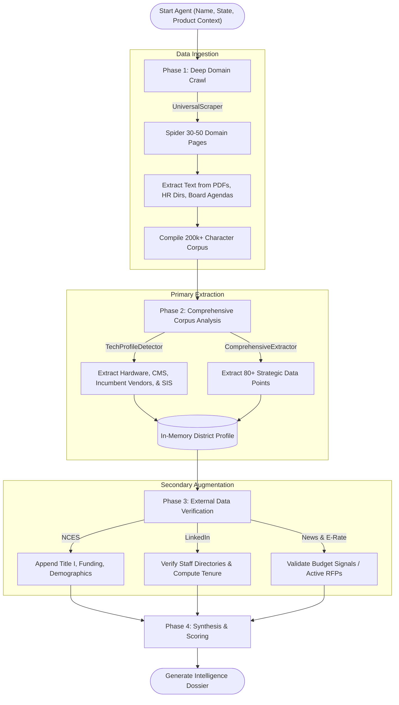
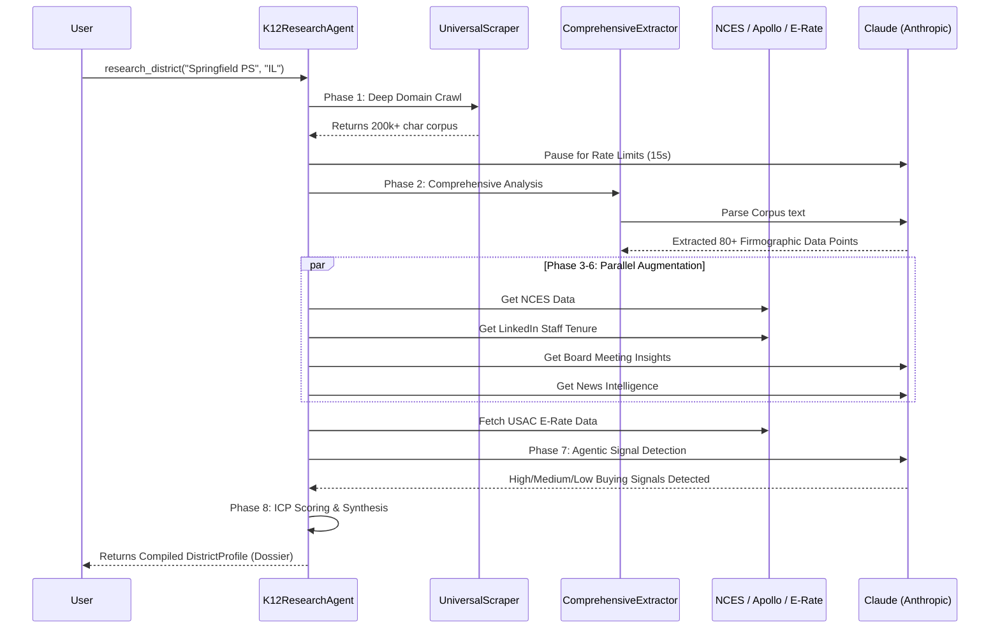

# K12 Research Agent 🎓🔍

The **K12 Research Agent** is a powerful AI-driven intelligence gathering tool designed specifically for EdTech sales and go-to-market teams. It operates autonomously to fetch, analyze, and synthesize data on school districts across the United States. 

By taking just a district name, state, and specific product context, the agent builds a comprehensive, 80+ data point **District Profile**, complete with an ICP (Ideal Customer Profile) score, decision-maker contacts, technology landscape analysis, and actionable buying signals.

---

## 🚀 Key Features

- **Universal Batch Ingestion:** Deep domain crawls of 30-50 localized district pages (Home, HR, Board Docs, Technology) to establish a massive, ground-truth context corpus.
- **Agentic Signal Detection:** Autonomously uses Claude and Tavily to hunt for active RFPs, board meeting tech agendas,ESSER funding, and newly appointed superintendents.
- **Comprehensive Tech Profiling:** Accurately maps the district's incumbent hardware (1:1 devices), LMS, SIS, and core ecosystem (Google vs Microsoft).
- **Multi-Source Augmentation:** Enriches raw data using public APIs like the **NCES (Urban Institute)**, **USAC E-Rate**, and leadership signals from **LinkedIn**.
- **Board Meeting Intelligence:** Proactively discovers and analyzes school board meeting minutes and agendas for highly predictive procurement signals.

---

## 🏗 System Architecture

The agent follows a deterministic yet highly deep **Batch Ingest ➔ Analyze ➔ Augment** pipeline known as the **"Universal Scrape Architecture"**.



---

## 🧠 Core Intelligence Modules

The modular design allows the agent to spin up parallel tasks using `concurrent.futures`.

1. **`NCESClient`**: Pulls deterministic firmographics (enrollment, per-pupil expenditure, locale type) from the Urban Institute Education Data API.
2. **`BoardMeetingIntelligence`**: Discovers the district's board page, extracts raw agenda documents, and uses Claude to analyze items for technology purchasing intents.
3. **`LeadershipIntelligence`**: Sources leadership contacts (Superintendents, CTOs, Curriculum Directors) and cross-verifies their tenure online. 
4. **`NewsIntelligence`**: Scans 18 months of localized news coverage to identify problem-to-opportunity mappings, sentiment, and bond measure news.
5. **`ErateIntelligence`**: Retrieves recent USAC E-Rate funding applications to measure active infrastructure spending.
6. **`TechProfileDetector`**: Maps LMS, SIS, and 1:1 hardware availability based on deep text analysis.
7. **`SignalDetector`**: The primary agentic loop. Tells Claude to read the results and dictate exactly what follow-up searches should be run to track down elusive signals.

---

## ⚙️ Data Flow & execution

When `agent.research_district()` is called, the pipeline executes in specific phases:



---

## 💻 Setup & Installation

### Prerequisites
- Python 3.11+
- API Keys: Tavily, Anthropic (Claude)
- Docker (optional, for containerized multi-service deployment)

### 1. Environment Variables
Create a `.env` file in the root directory and add the following:

```ini
TAVILY_API_KEY=tvly-xxxxxxxxxxxxx
APOLLO_API_KEY=xxxxxxxxxxxxx  # (Optional fallback)
ANTHROPIC_API_KEY=sk-ant-xxxxxxxxxxxxx
```

### 2. Standard Local Run (Python)

Create a virtual environment and load dependencies:

```bash
python3 -m venv venv
source venv/bin/activate
pip install -r requirements.txt
```

Run test scripts or the main engine:

```bash
python main.py
```

### 3. Docker Compose Deployment

The repo includes frontend and backend deployment configs. To spin up the entire application suite locally:

```bash
docker-compose up --build
```
This maps:
- **Backend Analytics API:** `localhost:8000`
- **Frontend Dashboard:** `localhost:5173`

---

## 🛠 Configuration (Product Context)

The most important configuration piece is the **`ProductContext`**. The agent is practically useless without knowing *what* it is researching for.

You define a product context in `config/templates.py`. This context dynamically alters search queries, scoring engine weights, and Claude's extraction focus.

```python
# Example Context for an AI Teaching Assistant Tool
AI_TEACHING_TEMPLATE = ProductContext(
    company_name="Acme AI",
    product_category="AI Teaching Assistant",
    keywords=["artificial intelligence", "teacher workflow", "grading automation", "lesson planning"],
    buyer_titles=["Director of Technology", "Chief Academic Officer", "Superintendent"],
    competitors=["MagicSchool", "Eduaide", "Khanmigo"],
    board_meeting_triggers=["AI policy", "teacher burnout", "generative AI guidelines"]
)
```

---

## 📊 Outputs & Formats

The agent returns a `DistrictProfile` dataclass which can be serialized into:

1. **Markdown**: An incredibly readable "Intelligence Brief" crafted by Claude to look like a report from a top-tier Sales Engineer.
2. **JSON**: A full relational data dump to pipe into external CRMs or front-end dashboards.
3. **SQLite**: Locally caches output metrics and intelligence inside `k12_research.db` and the large corpus in `scraper_cache.db`.

---

### *Disclaimer: Cost Projections*
*Running deep analysis relies heavily on `claude-3-haiku` / `sonnet` and Tavily search credits. Average API cost per fully analyzed district sits comfortably between **$0.13 - $0.31**, making this extremely viable for mass GTM intelligence batching.*
