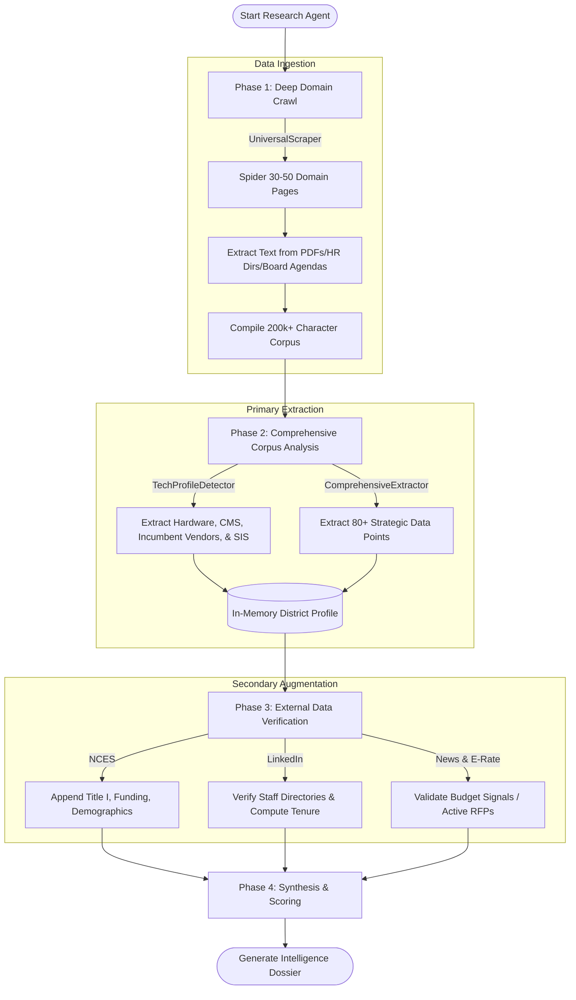

# Universal Scrape Architecture: Batch Ingest & Analyze

This document details the fundamentally redesigned "Site-First" intelligence ingestion architecture of the K12 Research Agent.

## The Paradigm Shift
The previous research model relied heavily on sequential, dynamic search engine queries (Tavily & Google) targeting specific combinations of keywords (e.g., `"District Name" "State" "SIS" log in`). This approach frequently missed nuanced data, ignored localized nuances, and fell victim to AI hallucinations when information was scarce online. 

The new "Universal Scrape Architecture" shifts the agent to a three-step **Batch Ingest -> Analyze -> Augment** pipeline. The priority is now to relentlessly pull all available first-party materials from the district's root domain *before* attempting any synthesis.

---

## Architecture Diagram

The following Mermaid diagram outlines the execution flow within `agent.py`:

---

## 1. Phase 1: Deep Domain Crawl
- **Module:** `UniversalScraper`
- **Action:** Instead of searching the web for answers, the agent establishes the district's root domain and acts as a localized spider.
- **Constraints:** Safely limited to ~30-50 pages (along with up to 5 pages per parsed PDF). This effectively captures the core nodes of the district's organizational structure: *Home, About Us, Board of Education, HR, Federal Programs, and Technology Policies*.
- **Output:** A massive string of raw text (often exceeding 200,000 characters), representing the ground truth of the school district's published state.

## 2. Phase 2: Comprehensive Corpus Analysis
- **Module:** `ComprehensiveExtractor` & `TechProfileDetector`
- **Action:** The massive raw corpus is processed in its entirety by the LLM (`claude-3-haiku` is given up to 200k tokens of context).
- **Goal:** Natively map and extract the 80+ intelligence data points crucial for the `DistrictProfile`. Because the LLM is digesting the raw unedited text from the school's footer and board minutes, the accuracy of Vendor Discovery (especially for niche or localized boutique agencies) is near perfect, avoiding prior LLM prompting biases.

## 3. Phase 3: External Augmentation
- **Modules:** `NCESClient`, `LeadershipIntelligence`, `NewsIntelligence`
- **Action:** Once the initial profile is populated entirely with first-person data, external modules are engaged sequentially to fill in missing gaps or augment and verify existing records.
- **Example:** LinkedIn is scraped not just to find who the IT Director is, but to accurately *verify the tenure and previous history* of the IT Director name that was already discovered on the district's internal staff directory during Phase 1.

## 4. Phase 4: Scoring and Synthesis
- **Modules:** `ScoringEngine` and `SynthesisEngine`
- **Action:** Identical to the previous iteration, this phase calculates the ICP Score and formats the agent's findings into the highly-readable `intelligence_brief` returned to the application front-end.
